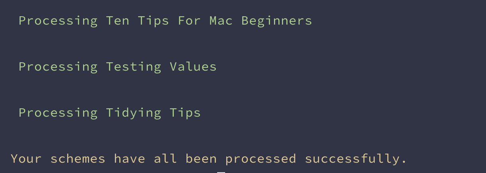
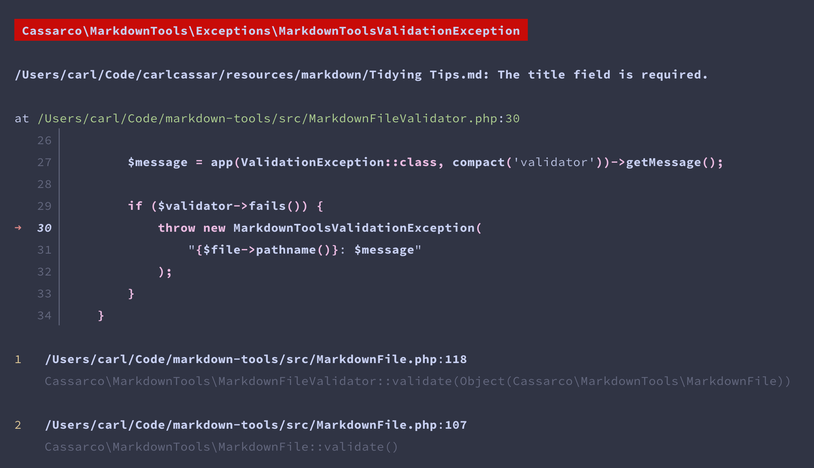

# markdown-tools

[](https://packagist.org/packages/cassarco/markdown-tools)
[](https://github.com/cassarco/markdown-tools/actions?query=workflow%3Arun-tests+branch%3Amain)
[](https://github.com/cassarco/markdown-tools/actions?query=workflow%3A"Fix+PHP+code+style+issues"+branch%3Amain)
[](https://packagist.org/packages/cassarco/markdown-tools)

This is a package for Laravel that lets you run Laravel Validation and/or a handler function over markdown files in your
application.

First, define one or more schemes in your configuration file. Then run the bundled command to process those schemes.
Read on for more detailed instructions.

## Installation

You can install the package via composer:

```bash
composer require cassarco/markdown-tools
```

You can publish the config file with:

```bash
php artisan vendor:publish --tag="markdown-tools-config"
```

This is the contents of the published config file:

```php
return [

    /*
    |--------------------------------------------------------------------------
    | Schemes
    |--------------------------------------------------------------------------
    |
    | Configure as many "schemes" as you like. Each scheme should contain a
    | path to a single markdown file or a folder containing markdown files.
    |
    */

    'schemes' => [

        // Give each scheme a name for your own organisation.
        'markdown' => [

            // Give the path to a folder of markdown files or a single markdown file.
            'path' => resource_path('markdown'),

            // Specify the validation rules for front-matter properties.
            'rules' => [
                // 'title' => 'required',
            ],

            // Define a handler for each markdown file. You will have access to file:
            //  - front-matter values
            //  - markdown
            //  - html
            //  - htmlWithToc
            //  - toc
            'handler' => function (MarkdownFile $file) {
                // Do Something with each Markdown File.
            },
        ],
    ],

    /*
    |--------------------------------------------------------------------------
    | League/Commonmark Settings
    |--------------------------------------------------------------------------
    |
    | Configure settings for League Commonmark and its extensions.
    |
    */

    'common-mark' => [

        'heading_permalink' => [
            'symbol' => '#',
            'html_class' => '',
            'aria_hidden' => false,
            'id_prefix' => '',
            'fragment_prefix' => '',
        ],

        'table_of_contents' => [
            'html_class' => 'table-of-contents',
            'position' => 'top',
            'style' => 'bullet',
            'min_heading_level' => 1,
            'max_heading_level' => 6,
            'normalize' => 'relative',
            'placeholder' => null,
        ],

        'wikilinks' => [],

        'front-matter' => [
            'yaml-parse-flags' => Yaml::PARSE_DATETIME
        ]
    ],
];
```

## Usage

First define one or more schemes:

```php
use function Laravel\Prompts\info;

return [
    'schemes' => [
        'markdown' => [
            'path' => resource_path('markdown'),
            'rules' => [
                'title' => 'required',
            ],
            'handler' => function (MarkdownFile $file) {
                info("Processing {$file->frontMatter()['title']}");
            },
        ],
    ],
]
```

Now run the bundled command to process these schemes:

```bash
php artisan markdown-tools:process
```

In this example you will see a list of titles for every markdown file in the folder `resources/markdown`, provided that
they have a title property in the markdown's front matter.



If one or more of them do not, then you will see a Laravel
Validation error.



You should be able to use any of
the [Laravel Validation Rules](https://laravel.com/docs/master/validation#available-validation-rules) that make sense in
this context.

Notice that the handler makes a Markdown File `$file` available to you on which you will find the following methods:

```php
// Get the markdown for the markdown file.
$file->markdown()

// Get the front matter as a php array
$file->frontMatter()

// Get the html for the markdown file without a table of contents.
$file->html()

// Get the html table of contents.
$file->toc()

// Get the markdown file as html with the table of contents embedded.
$file->htmlWithToc()

// Get the pathname for the markdown file
$file->pathname()
```

In my case, I use this package to import the markdown files into my database for [https://www.carlcassar.com](https://www.carlcassar.com):

```php
Article::updateOrCreate([
    'slug' => $file->frontMatter()['slug'] ?? Str::slug($file->frontMatter()['title']),
], [
    'title' => $file->frontMatter()['title'],
    'slug' => $file->frontMatter()['slug'] ?? Str::slug($file->frontMatter()['title']),
    'description' => $file->frontMatter()['description'],
    'table_of_contents' => $file->toc(),
    'content' => $file->html(),
    'image' => $file->frontMatter()['image'],
    'tags' => $file->frontMatter()['tags'],
    'published_at' => Carbon::make($file->frontMatter()['published_at']),
    'deleted_at' => Carbon::make($file->frontMatter()['deleted_at']),
    'created_at' => Carbon::make($file->frontMatter()['created_at']),
    'updated_at' => Carbon::make($file->frontMatter()['updated_at']),
]);
```

## Testing

```bash
composer test
```

## Changelog

Please see [CHANGELOG](CHANGELOG.md) for more information on what has changed recently.

## Contributing

Please see [CONTRIBUTING](CONTRIBUTING.md) for details.

## Security Vulnerabilities

Please review [our security policy](../../security/policy) on how to report security vulnerabilities.

## Credits

- [Cassar & Co](https://github.com/cassarco)
- [All Contributors](../../contributors)

## License

The MIT License (MIT). Please see [License File](LICENSE.md) for more information.
